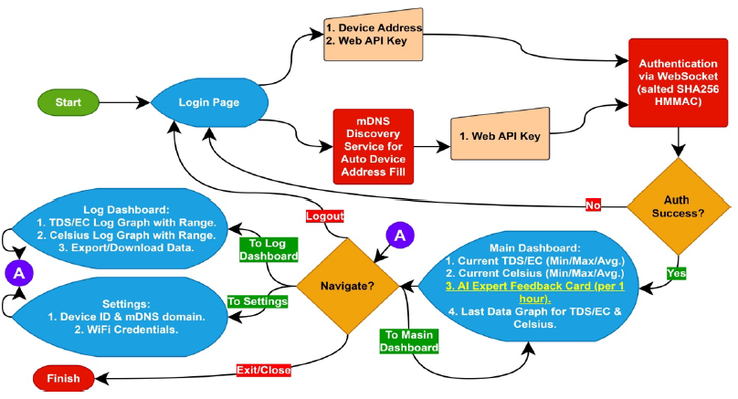
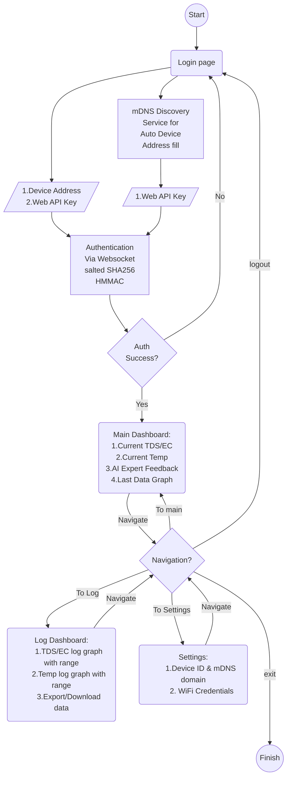
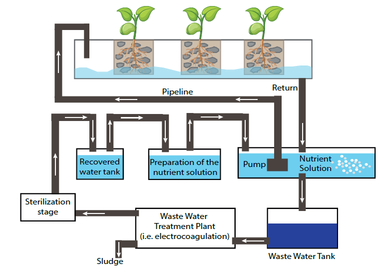
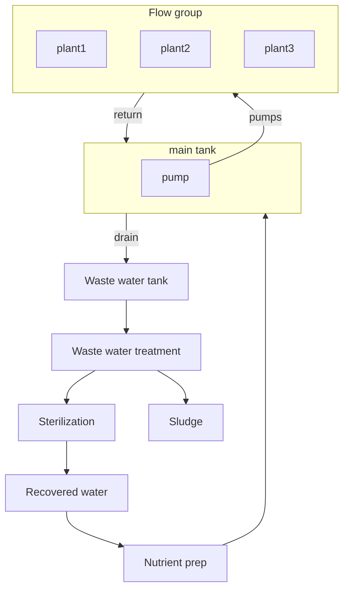
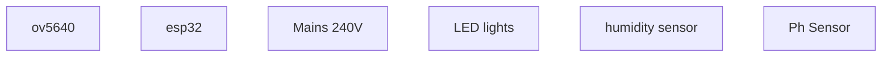
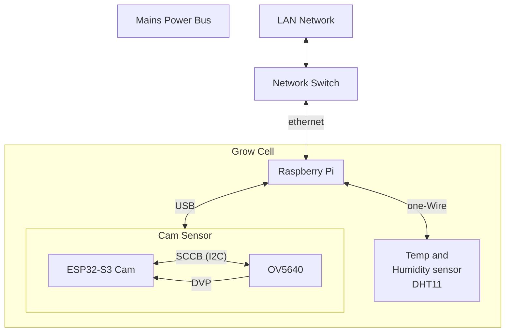
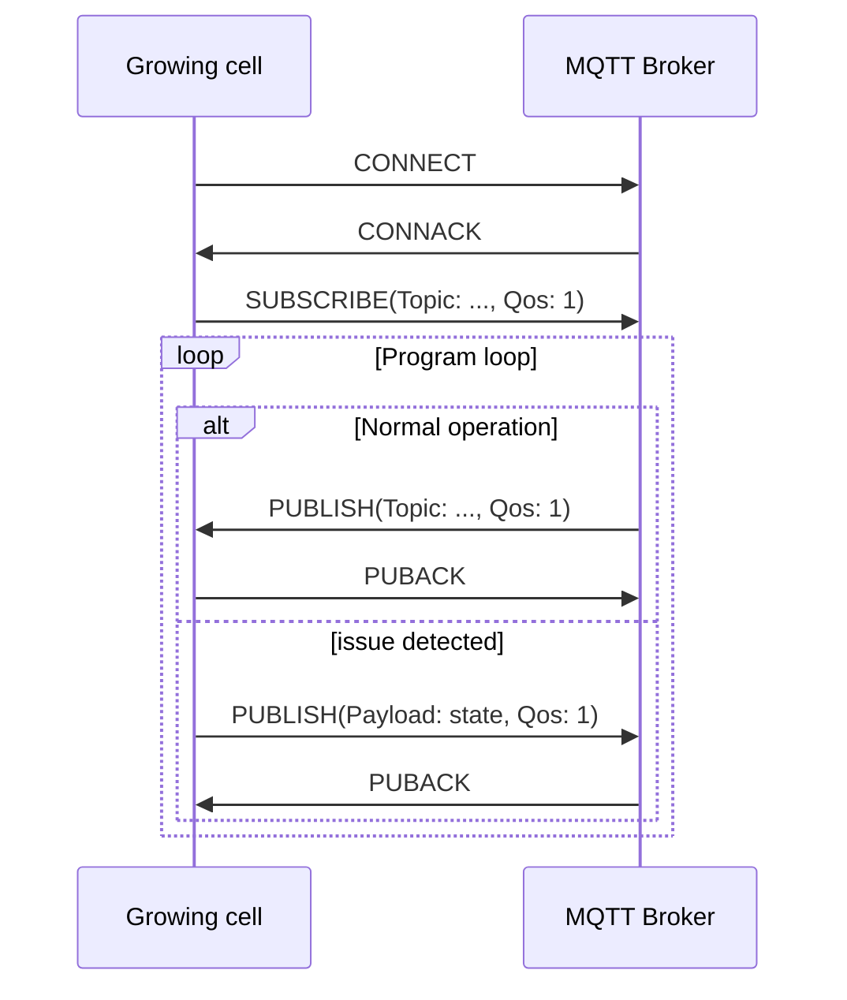

# UML modeling for vert-farm

## User flow

Based off this illustration.

## Water cycle

Based off this illustration of the water flow through the system.

## Electronics

### Cell

## MQTT Sequence

From William

